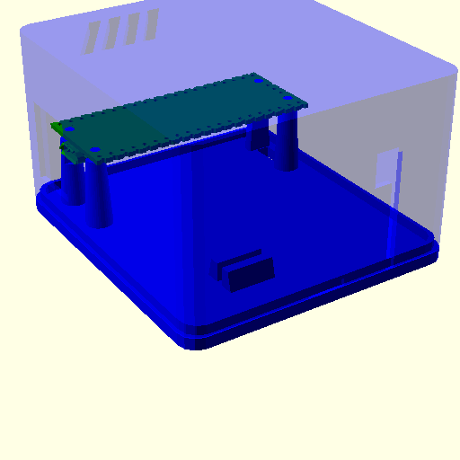
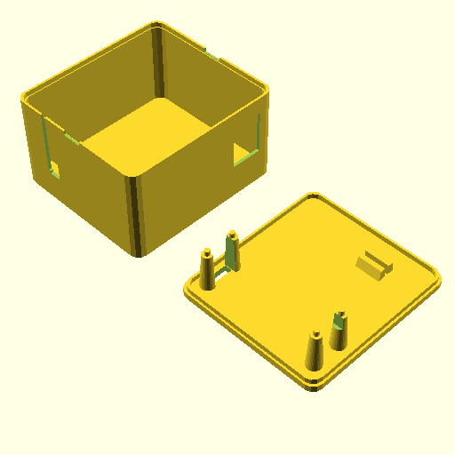

# Enclosure to support a Raspberry Pi Pico with additional module slot

Features:
- base, with screwless risers to support the Pico board and a slot for additional module
- alow inverted, with space for USB connector and downward pin headers
- slot to access SWD pins through floor of case
- slot on side to have an external cable that might soldered to the additional module
- air vent on roof

The model includes a model of a Raspberry Pico PCB available on the Core Electronics website. I converted this to STEP with FreeCAD so I could import it into OPenSCAD for visualisation.

